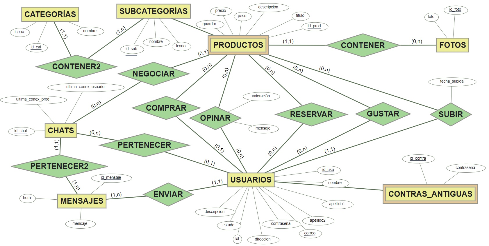
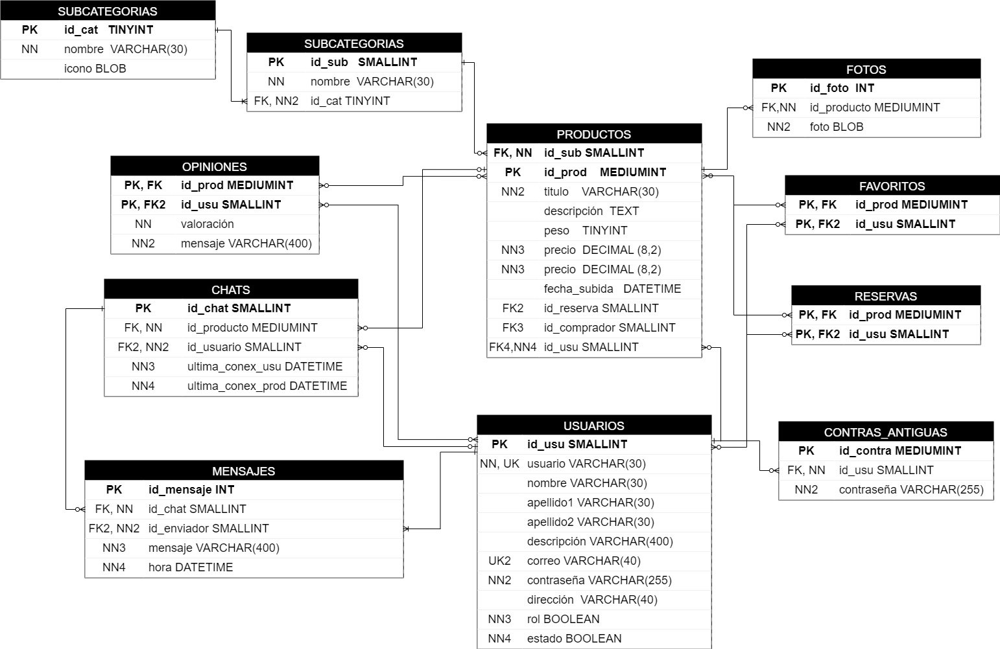

# 📋 Base de Datos
Modelo Entidad-Relación y Relacional de la aplicación.
## 🖥️ Entidad-Relación
Creada con la aplicación [erMaker](https://jorgesanchez.net/ermaker/) de [Jorge Sánchez](https://jorgesanchez.net/).

## 🖥️ Relacional
Creada con la herramienta [draw.io](https://app.diagrams.net/).
 
