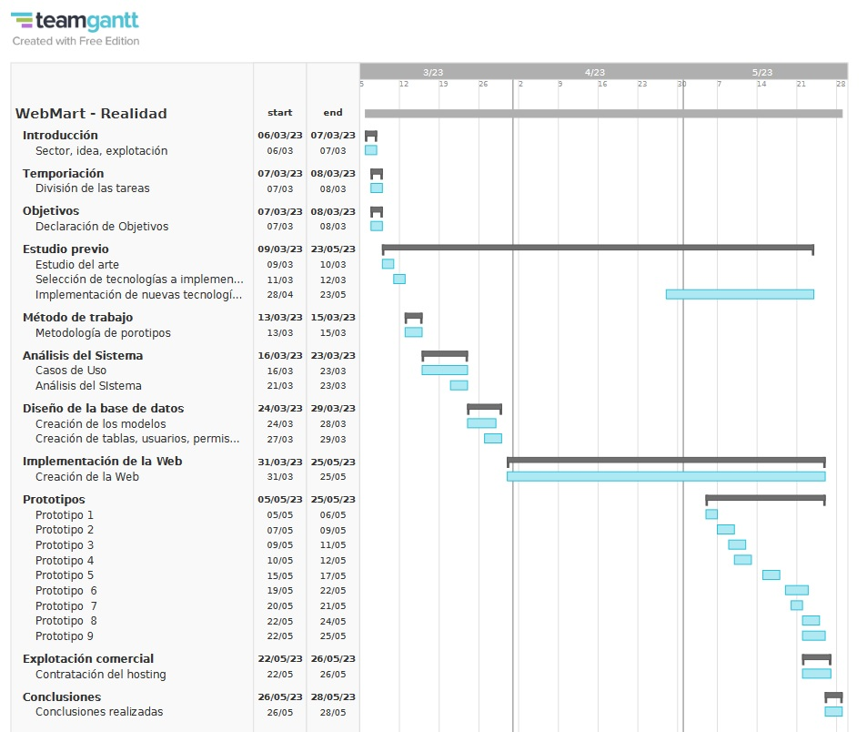
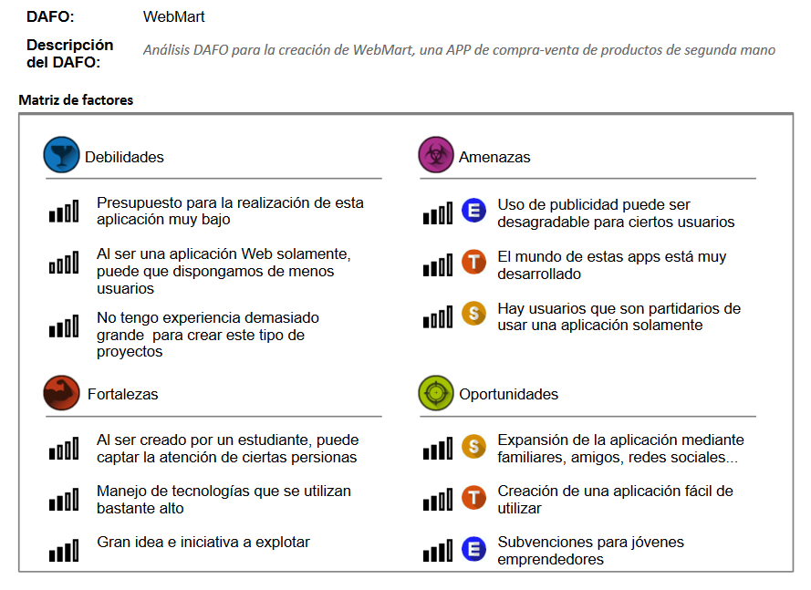

# 💡 Información Extra
Análisis DAFO y temporización de los objetivos.
## ⌛ Temporización
En esta se ve la cronología de toda la estructura de la aplicación, y el tiempo que me ha llevado hacer cada cosa, por ejemplo:
* Introducción.
* Objetivos.
* Metodología que utilicé.
* Análisis y diseño del sistema.
* Implementación de la Web y de los prototipos.

Esta conología la he realizado con la aplicación [teamGantt](https://www.teamgantt.com):

## 🔬 Análisis DAFO y CAME
Un análisis DAFO, también conocido como análisis FODA (Fortalezas, Oportunidades, Debilidades y Amenazas), es una herramienta de planificación estratégica utilizada por las empresas y organizaciones para evaluar su situación interna y externa. Permite identificar y comprender los factores internos y externos que pueden afectar su desempeño y éxito en el mercado.

He utilizado la siguiente herramienta [DAFO](https://dafo.ipyme.org/Home) para recrearla.

